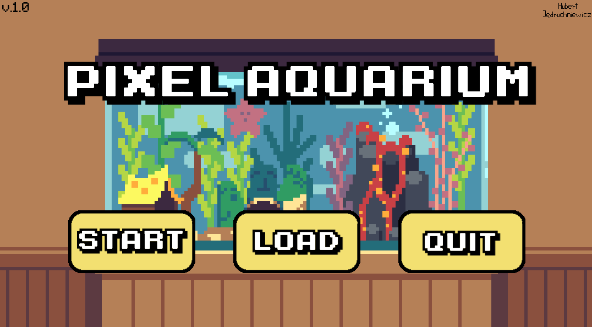
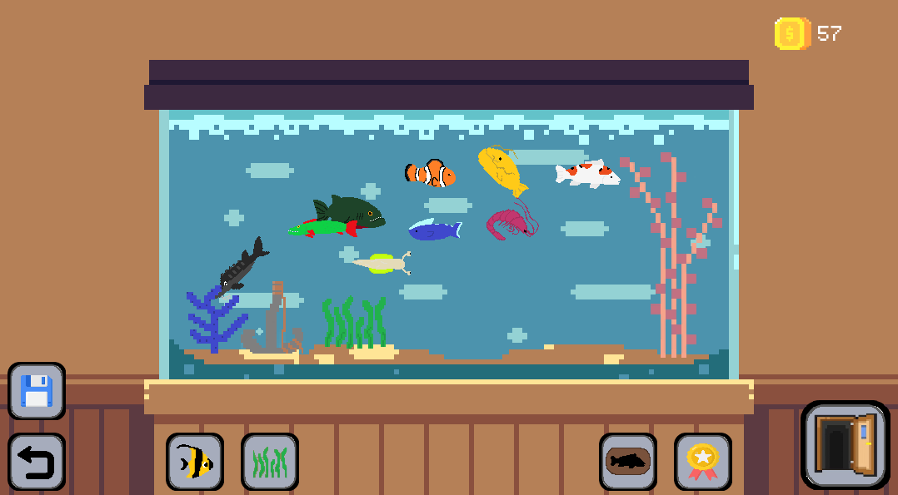
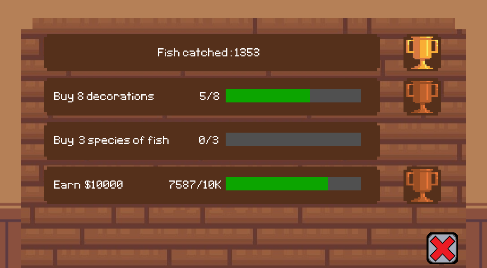
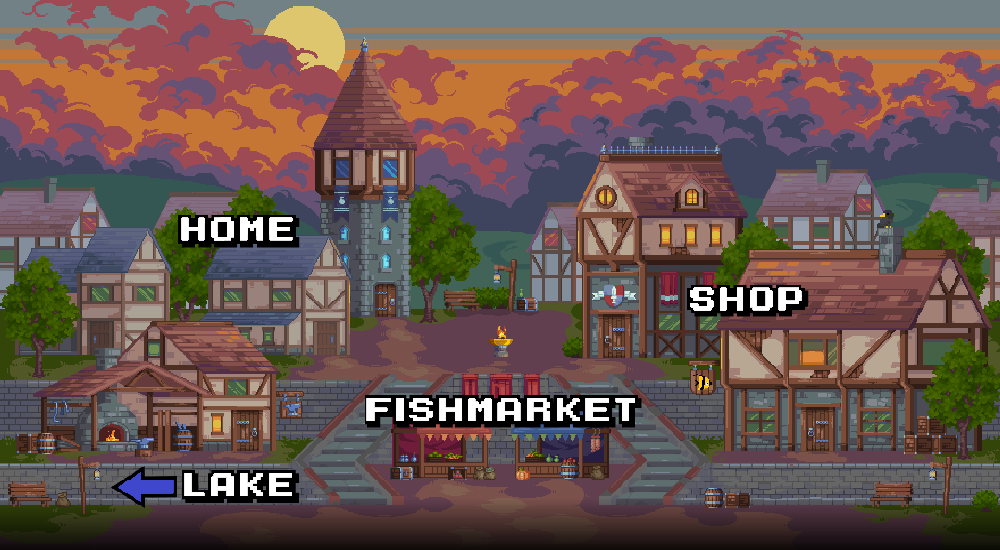
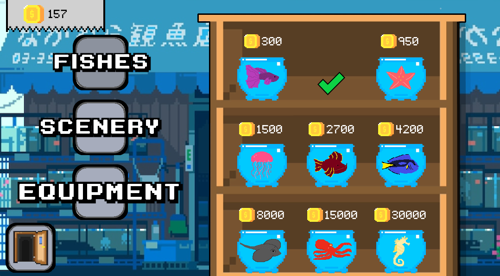
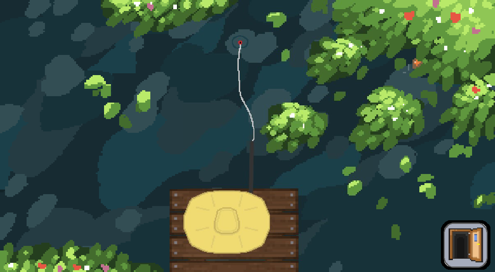
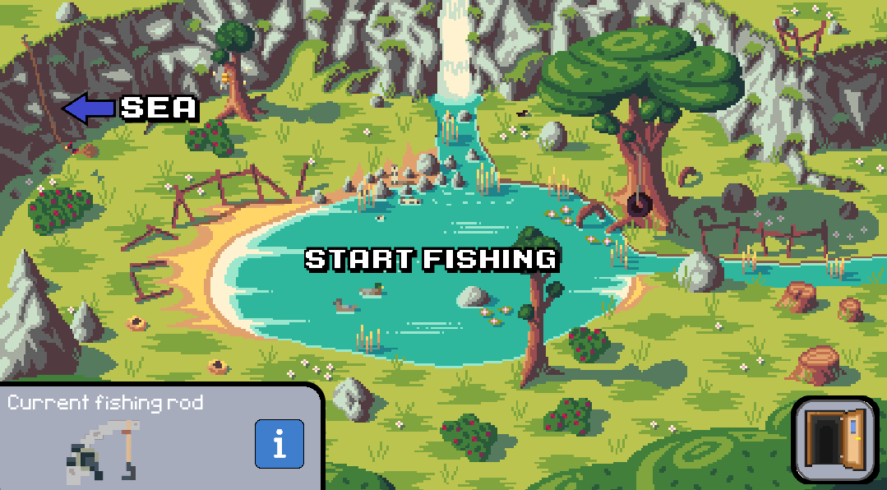
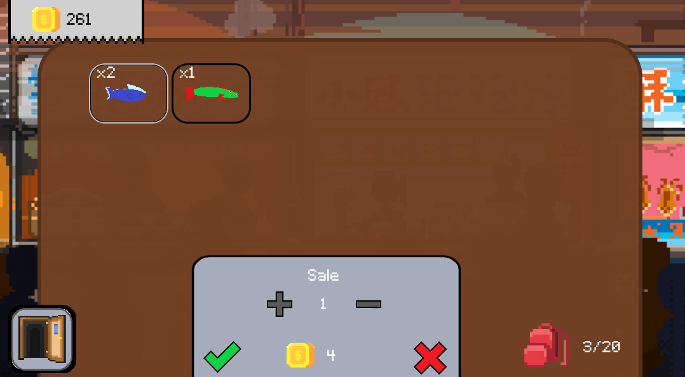

# Pixel Aquarium - window game about fishing and arranging aquarium

  

## Table of Contents
- 🚀 [Project Overview](#project-overview)
- ✨ [Features](#features)
- 💻 [Technologies](#technologies)
- 📋[Requirements](#requirements)
- 🛠️ [Setup Instructions](#setup-instructions)
- 📸 [Screenshots](#screenshots)

## Project Overview

**Pixel Aquarium** is a 2D game in which the player focuses on designing his own aquarium. To do so, he catches fish - to display in the aquarium or sell for profit - which allows him to upgrade his equipment, buy various decorations and collect exotic aquatic creatures. Completing the game should take a few hours. 
> [!NOTE]  
> The game is available in English language version!

## Features

- 🐟 26 species to get
- 🪸 12 diverse decorations to buy
- 🎣 Fishing equipment upgrades
- ✨ Subtle animations throughout the game world
- 📊 Statistics allowing you to track, among other things, the amount of money earned and fish caught
- 🏆 Achievements and rewards for catching new aquatic species
- 💾 Ability to save your game progress

## Requirements
Any system capable of running .exe files.

## Technologies

- Python 3.10 using the Pygame library

## Setup Instructions

1. Extract the `Pixel Aquarium.zip` file.
2. Run the `Pixel Aquarium.exe` file to start the game.

## Screenshots

  
  
  
  
  
  
  
  

